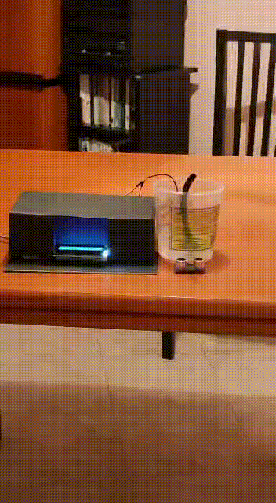

# IgienizzanteAutomatico

IgienizzanteAutomatico ha come obiettivo la realizzazione di un distributore automatico di igienizzante per le mani e di un tracker di casi positivi e morti di Coronavirus in Italia.

## Demo 

### Igienizzante Automatico:

<br/>
<p align="center">
  
</p>
<br/>
<br/>

### Covid19 Tracker:

<br/>
<p align="center">
  
</p>
<br/>
<br/>

## Built with:

* [Arduino](https://www.arduino.cc/)
  
## Components

```
* ESP32
* Sensore a ultrasuoni HC-SR04
* LCD 16x2
* Mini pompa dell'acqua DC 3-6V
* Modulo relè 5V Keyes_SR1Y
* Igienizzante per mani
* Contenitore igienizzante
```

## Project

Il sensore a ultrasuoni viene utilizzato per verificare la presenza delle mani.\
Calcolerà la distanza tra sè stesso e qualsiasi ostacolo(in questo caso le mani) continuamente e avviserà ESP32 di accendere la pompa ogni volta che la distanza sarà inferiore o uguale a 15cm, in modo da far fuoriuscire l'igienizzante automatico.\
La pompa è collegata a ESP32 tramite il modulo relè.\
In contemporanea ESP32, tramite il modulo Wifi 802.11, invocherà una richiesta HTTP GET per leggere il contenuto di un file JSON che contiene i dati sull'andamento del Covid19 in Italia. In particolare vengono estratti i numeri di casi positivi e morti che verranno poi mostrati sul display LCD.

## Circuit Diagram


## Author

* **Alessandro Farè**
