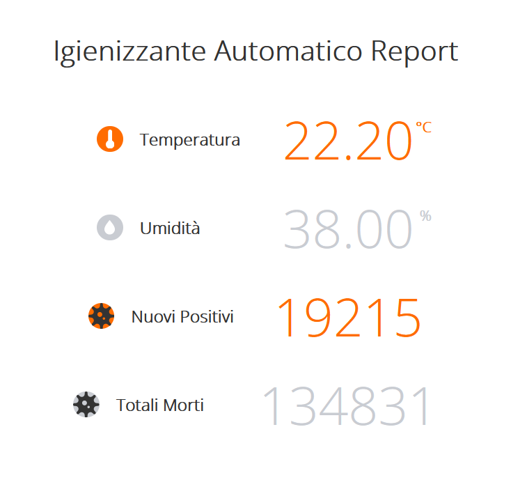

# IgienizzanteAutomatico

IgienizzanteAutomatico ha come obiettivo la realizzazione di un distributore automatico di igienizzante per le mani e di un tracker di casi positivi e morti di Coronavirus in Italia.

## Demo 

### Igienizzante Automatico:

<br/>
<p align="center">
  
</p>
<br/>
<br/>

### Covid19 Tracker:

<br/>
<p align="center">
  
</p>
<br/>
<br/>

### Web Page Report:

<br/>
<p align="center">
  
</p>
<br/>
<br/>

## Built with:

* [Arduino](https://www.arduino.cc/)
  
## Components

```
- ESP32
- Sensore a ultrasuoni HC-SR04
- LCD 16x2
- Mini pompa dell'acqua DC 3-6V
- Modulo relè 5V Keyes_SR1Y
- DHT11
- Igienizzante per mani
- Contenitore igienizzante
```

## Project

Il progetto è stato implementato utilizzando la libreria TaskScheduler che permette un approcio cooperative multitasking.\
In particolar modo è composto da 6 task, ognuno con tempi di esecuzione differenti.

```
1. Get Request per numero positivi e morti -> ogni 12 ore

   ESP32, tramite il modulo Wifi 802.11, invocherà una richiesta HTTP GET 
   per leggere il contenuto di un file JSON che contiene i dati sull'andamento del Covid19 in Italia.
   In particolare vengono estratti i numeri di casi positivi e morti.
 
 
2. WebPage Report usando SPIFFS -> ogni 100 millisecondi

   E' stata caricata sul file system di ESP32, SPIFFS, una pagina HTML che mostrerà in tempo reale
   i valori di temperatura e umidità e il numero di casi positivi e morti di Covid19.
   Tramite uno script AJAX i valori saranno modificati senza dover ricaricare la pagina.
   La pagina sarà caricata su un server asincrono, sulla porta 80.
   I valori di temperatura e umidità sono calcolati tramite modulo DHT11.


3. Calcolo distanza ultrasuoni + Attivazione Pompa + Bilanciamento fuoriuscita 
   igienizzante in base a distanza da sensore ultrasuoni -> ogni 100 millisecondi
   
   Il sensore a ultrasuoni viene utilizzato per verificare la presenza delle mani.
   Calcolerà la distanza tra sè stesso e qualsiasi ostacolo(in questo caso le mani) continuamente
   e avviserà ESP32 di accendere la pompa ogni volta che la distanza sarà inferiore o uguale a 15cm,
   in modo da far fuoriuscire l'igienizzante automatico. La pompa è collegata a ESP32 tramite il modulo relè.
   Inoltre, quando si attiva la pompa, viene bilanciata la velocità di uscita 
   dell'igienizzante in base alla distanza delle mani dal sensore.
   Più le mani si trovano lontano dal sensore, più la velocità diminuirà.


4. Check condizioni ambientali per muffa (Deep sleep 30 minuti) -> ogni 5 minuti

   Se le condizioni ambientali portano al fenomeno della muffa, 
   ovvero quando la temperatura è compresa tra i 18 e i 24 gradi e l'umidità è maggiore o uguale del 75%,
   il sistema sarà messo in deep sleep; sarà ON solo l'RTC e il sistema verrà riattivato solo dopo 30 minuti.


5. Check condizioni ambientali per variazione delay fuoriuscita igienizzante -> ogni 30 secondi

   Sarà variata la velocità di fuoriuscita dell'igienizzante in base alle condizioni ambientali.
   Se la temperatura è elevata viene aumentata la velocità, viceversa sarà diminuita.
   Se l'umidità è elevata viene diminuita la velocità, viceversa sarà aumentata.
 
 
6. Stampa su LCD numero positivi e morti -> ogni 100 millisecondi

   Verrà stampato su display LCD il numero di positivi e morti di Coronavirus.
   
```

## Circuit Diagram

<br/>
<p align="center">
  
</p>
<br/>
<br/>

## Author

* **Alessandro Farè**
